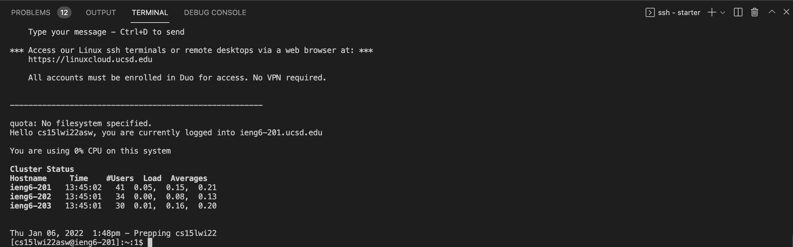

> Step 1: Visual Studio Code


Go to this [link](https://code.visualstudio.com/) to download Visual Studio Code and follow the instructions to install in on your computer. 

> Step 2: Remotely Connecting



Open up a terminal in VSCode and type 

`ssh cs15lwi22asw@ieng6.ucsd.edu`

If it is your first time connecting to a server, you'll get something similar to this message. 

```
ssh cs15lwi22asw@ieng6.ucsd.edu
The authenticity of host 'ieng6.ucsd.edu (128.54.70.227)' can't be established.
RSA key fingerprint is SHA256:ksruYwhnYH+sySHnHAtLUHngrPEyZTDl/1x99wUQcec.
Are you sure you want to continue connecting (yes/no/[fingerprint])? 
```

Type `yes` and then type in your password. 

> Step 3: Run Some Commands


Here are some commands and what they do:
* `cd ~` : Changes to home directory
* `cd` : Change directory
* `ls -lat` : List out a
* `ls -a` : List out all the files, even the hidden ones

> Step 4: Moving Files over SSH with `scp`


`scp` copies files from your computer to a remote computer. We always run it from the client (not logged into ieng6). To log out of the remote server, run the command `exit`. 

In the terminal from the directory where you made this file, run the command

`scp <File Name> cs15lwi22asw@ieng6.ucsd.edu:~/`

and type in your password. 

Log into ieng6 with `ssh` and use `ls`. You should be able to see the files in your home directory. 

> Step 5: SSH Keys


Make sure you're on the client. Run 

`ssh-keygen`

Enter the file where you want to save the key. Then enter passphrase or press enter for no passphrase. 

Now let's copy the public key to the `.ssh` directory of your user account on the server. Type

`ssh cs15lwi22asw@ieng6.ucsd.edu`

log in, and type

`mkdir .ssh`

then `exit`. 

You should now be able to `ssh` or `scp` from the client to the server without entering your password. 

> Step 6: Optimizing Remote Running


We can make remote running even faster by using quotations around a command at the end of an `ssh` command to directly run it on the remote server:

`ssh cs15lwi22asw@ieng6.ucsd.edu "ls"`

We can use semicolons to run multiple commands on the same line: 

`cp WhereAmI.java OtherMain.java; javac OtherMain.java; java WhereAmI`

And we can use the up arrow to recall the last command(s) that were run. 

