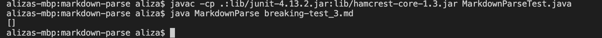

# Lab Report 2

> Bug 1

[Bug 1 Test File](https://github.com/liiizy/markdown-parse/blob/main/breaking-test.md)

This bug is presented when there is a set of parenthesis within the link in the test file. The program isn't sure where the link ends because there is another set of parenthesis.

> Bug 2

[Bug 2 Test File](https://github.com/liiizy/markdown-parse/blob/main/breaking-test_2.md)

This bug occurs when there is not a closing parenthesis for the link. Since there is no closing parenthesis, the program continues reading the next line of code until there is a closing parenthesis which produces the output above. 

> Bug 3

[Bug 3 Test File](https://github.com/liiizy/markdown-parse/blob/main/breaking-test_3.md)

The bug occurs when the test file does not contain a link. Since the file is empty, the program returns `[]` instead of an error message. 

