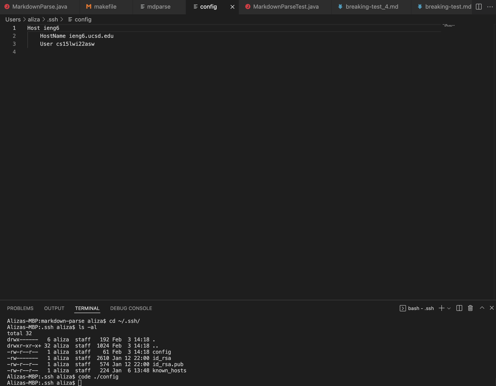
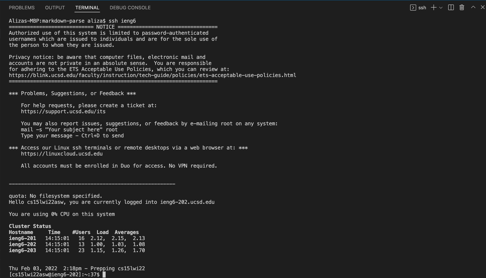
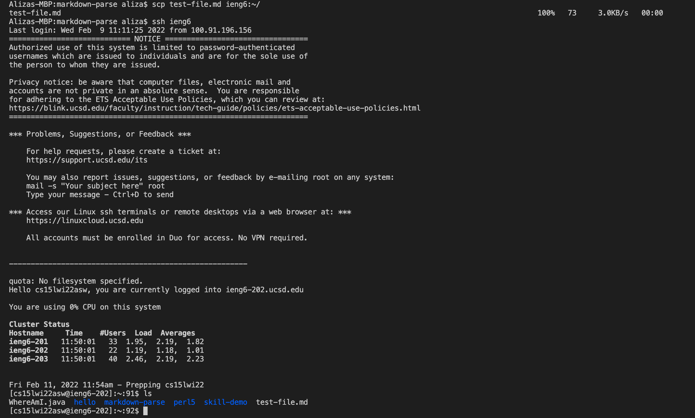

# Lab Report 3

> Streamlining `ssh` Configuration

This is my `.ssh/config` file. I edited it through VS Code as seen in the image above. 

This image shows the `ssh` command. I simply typed `ssh ieng6` and it logged me into the remote server. I prefer using `ieng6` after the `ssh` instead of my own alias, so I just kept it as `ieng6`.

This shows me copying the `test-file.md` file onto the remote server using just `ieng6` instead of my entire username. 