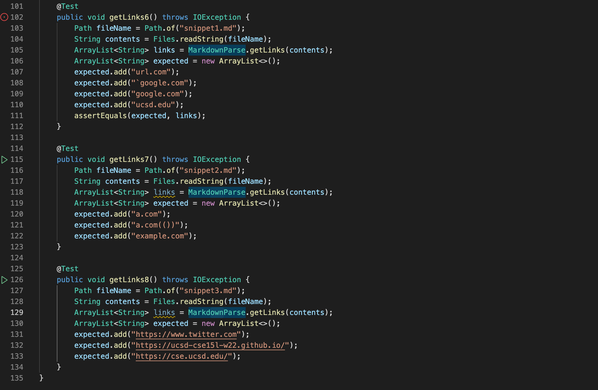

# Lab Report 4

[My Repository](https://github.com/liiizy/markdown-parse)

> Expected outputs shown in VS Code:

> Test code:

> Test output:

[Other Group's Repository](https://github.com/CatherineGu16/CSE15L-RoseateSpoonbill)

> Other lab group's test code:

> Other lab group's code output:

> Questions:
1. There is a small change that will make my program work for snippet 1. I don't think I've ever seen a URL with a backtick, so I would change the program to remove any backticks in the URL. 
2. There is also a small change that will make my program work for snippet 2. I've also never seen nested brackets or parenthesis, so I would make the program only accept those with one set of brackets or one set of parentheses. 
3. I don't think there is a small change that will make my program work for snippet 3 and all related cases. There are other variations that my code would have to account for and more lines of code would be needed to take into account the different possibilities. 

