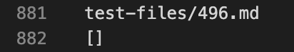
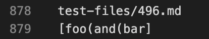
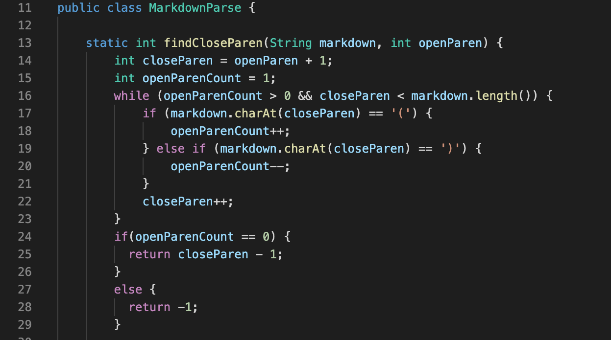
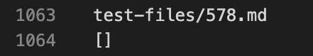
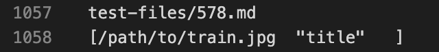

# Lab Report 5

## First Test

> Lab 9 implementation:

> My implementation:

- I found the different outputs by putting all the outputs into a `.txt` file, then compared each test manually. 
- The expected output for this test is `[foo(and(bar]` which is the output my implementation had. 

- In lines 16 - 23 of the Lab 9 implementation, the condition in the while loop and the if statements assume the links have closing parentheses, but this is not the case with the link in this test. 

## Second Test

> Lab 9 implementation:

> My implementation:

- I found the different outputs by putting all the outputs into a `.txt` file, then compared each test manually.
- Neither implementations for this test case is correct. The expected output is not a format for a link, it is the format for an image ``.

- Instead of using closing parenthesis as an indicator of when the link ends, we probably could use a condition that is more specific such as specifying the different characters that the end of a domain should/can look like. Right now, my implementation uses the clothing parenthesis as a guide to when the link ends, so that's why it did not produce the expected output.